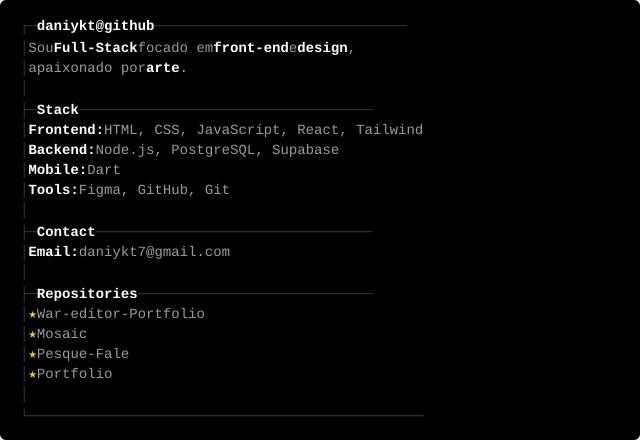

<!-- Arte no topo -->

  

<!-- About me: eyes + card terminal -->
<table>
<tr>
<td valign="middle" width="35%" align="center">

</td>
<td valign="middle" width="65%">

</td>
</tr>
</table>

<!-- GitHub stats (tema preto) -->

  

 

<!-- Contribution snake -->

  <picture>
    <source media="(prefers-color-scheme: dark)" srcset="https://raw.githubusercontent.com/zec4o/zec4o/output/github-contribution-grid-snake-dark.svg">
    
  </picture>

